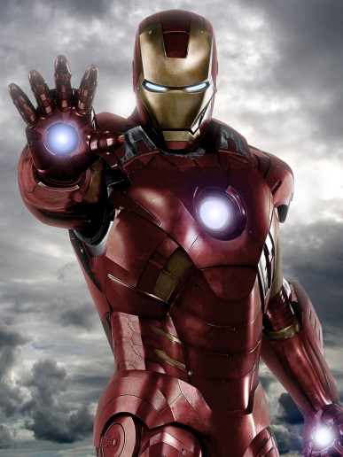

## IT2600 - Digital Multimedia
#### Git, GitHub, & Markdown Challenge

[Something I would buy if I had money](https://www.newegg.com/Product/Product.aspx?Item=N82E16814487338&ignorebbr=1)

[Link to whateverYoudLike](whateverYoudLike.md)

An image in the directory of my favorite super hero: 

An image link to the best Starfleet captain: 

```C
    ["hip","hip"]; //it's a hip hip array!!...
```

A programmer's wife sent him to the store. Her instructions were: 
> "Buy a loaf of bread. If they have eggs, buy a dozen."

The programmer came home with 12 loaves of bread.

